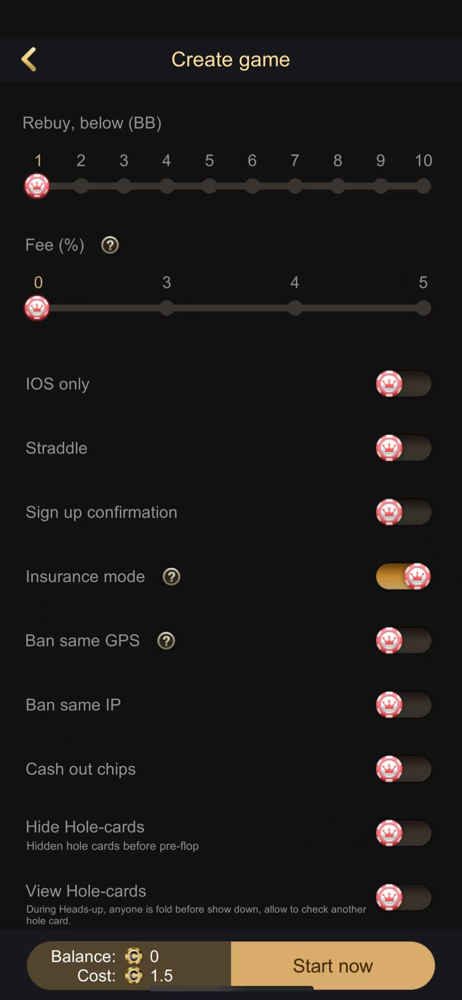
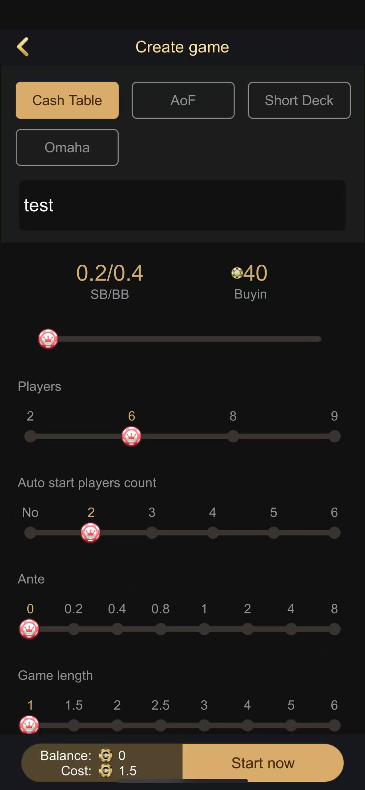
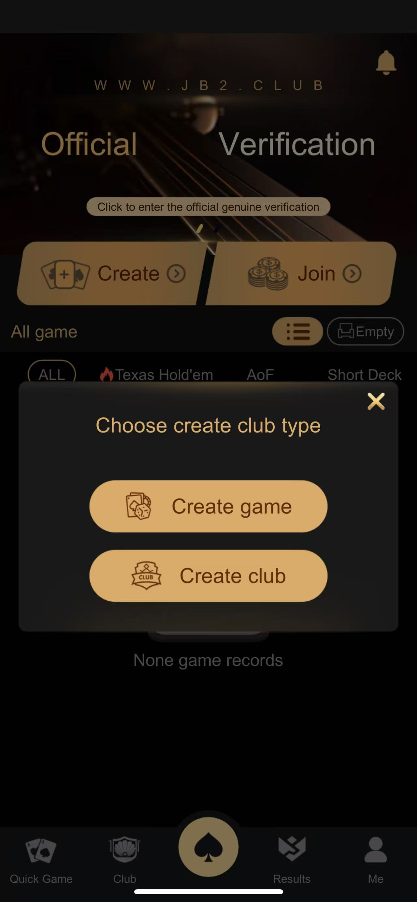
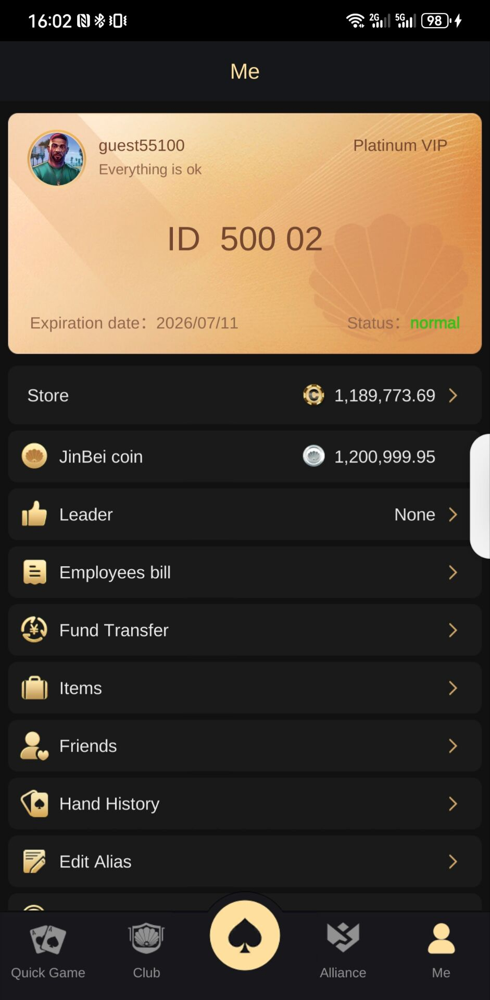
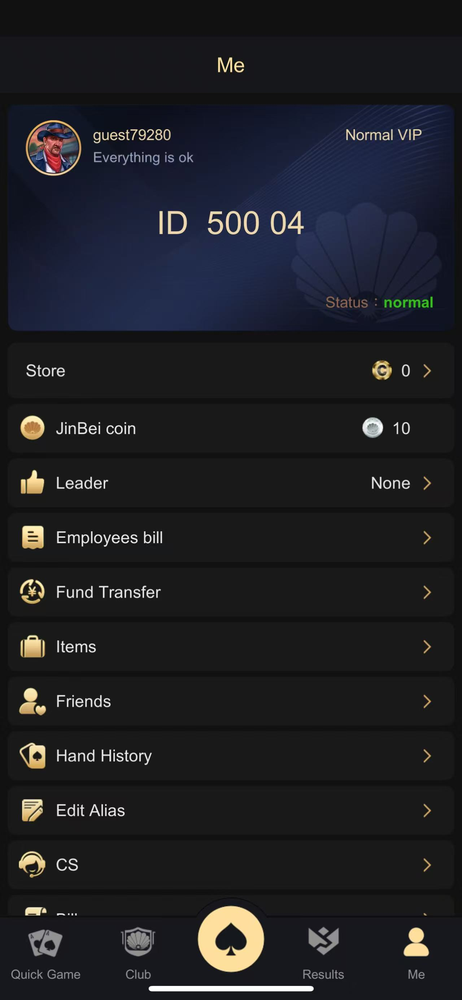

[简体中文](README.md) | [繁體中文](README.zh-TW.md) | [English](README.en.md) | [圖文網站](https://masterai-top.github.io/texas-holdem-poker-club-server/zh-tw/)

# C++ 德州撲克俱樂部推送伺服器原始碼

面向德州撲克俱樂部和多人房間的 C++/Tars 後端服務，重點處理訊息推送、玩家線上狀態、遊戲狀態、房間玩家上報、廣播與維護通知。倉庫的真實產品截圖則說明此服務在俱樂部、私人牌局及多玩法客戶端中的整合場景。

> 公開內容主要是 `PushServer` 與相關協議，不代表完整 Unity 客戶端或全部牌桌服務。畫面功能和可交付模組需另行核驗。

## 核心流程

網關上報線上玩家 → PushServer 維護線上/遊戲狀態 → 房間上報玩家與桌子資訊 → 服務按使用者路由推送訊息 → 廣播維護、紅點或狀態變更通知。

## 可核驗功能

- 單人、多人訊息與全服廣播。
- 玩家線上狀態上報、單筆/批次查詢及線上清單。
- 遊戲狀態上報和查詢。
- 房間玩家集合、桌子資訊與線上統計上報。
- 服務維護、紅點、玩家凍結和狀態通知。
- MySQL 客戶端、DBAgent 代理及服務路由。

## 產品玩法與畫面

截圖展示快速加入/建立房間、俱樂部、現金桌、AOF、短牌、奧馬哈、SNG、MTT、戰績及多語言入口。這些是整合產品畫面，不代表所有玩法程式碼均包含在此公開倉庫。

| 私人局設定 | 玩法設定 | 建立俱樂部 |
| --- | --- | --- |
|  |  |  |

| 快速加入 | 俱樂部大廳 | 戰績統計 |
| --- | --- | --- |
|  |  |  |

## 技術架構

服務使用 C++、Tars Application/Servant、`.tars` 介面、Tars MySQL 和 DBAgent 代理。管理命令包含設定重載、清理線上狀態、每日重置與維護通知。Makefile 依賴倉庫外的 Tars 公共協議與內部模組，建置前須補齊依賴並移除硬編碼部署資訊。

## 聯絡與核驗

Telegram：[@xuzongbin001](https://t.me/xuzongbin001) · Email：masterai918@gmail.com

請依實際交付清單核對功能、相依、授權和法規。本倉庫不保證並發量、完整部署、收益或搜尋排名。

